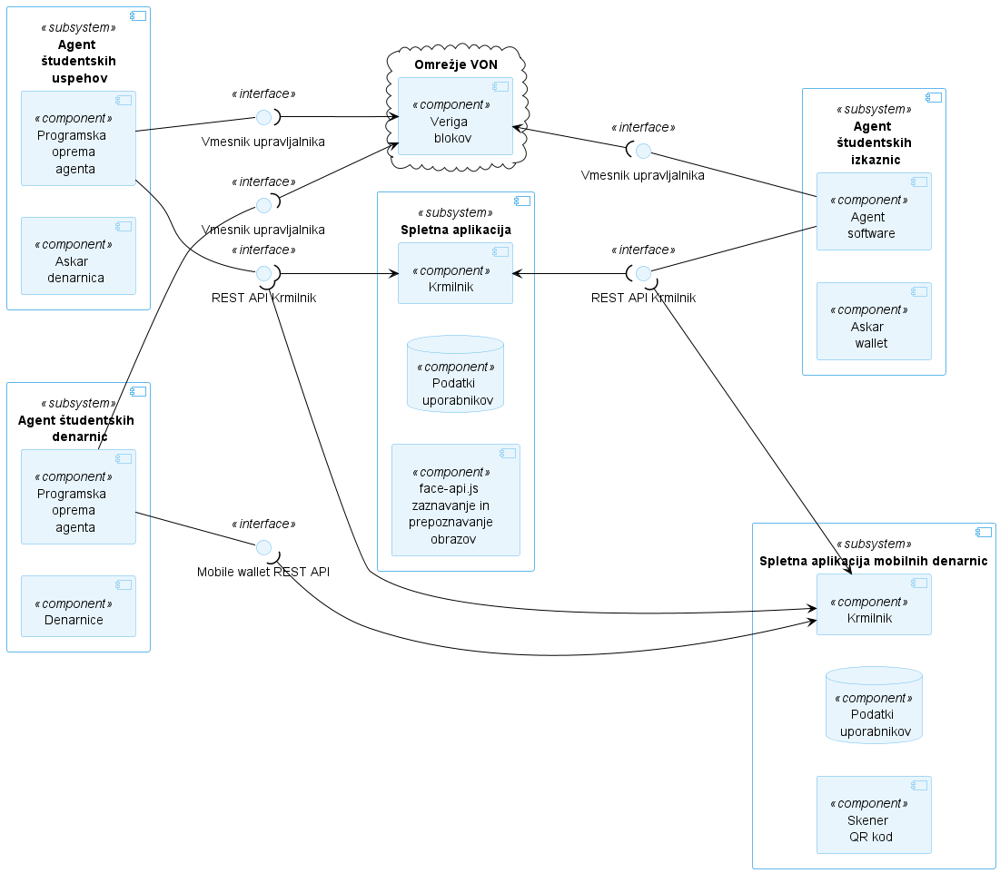
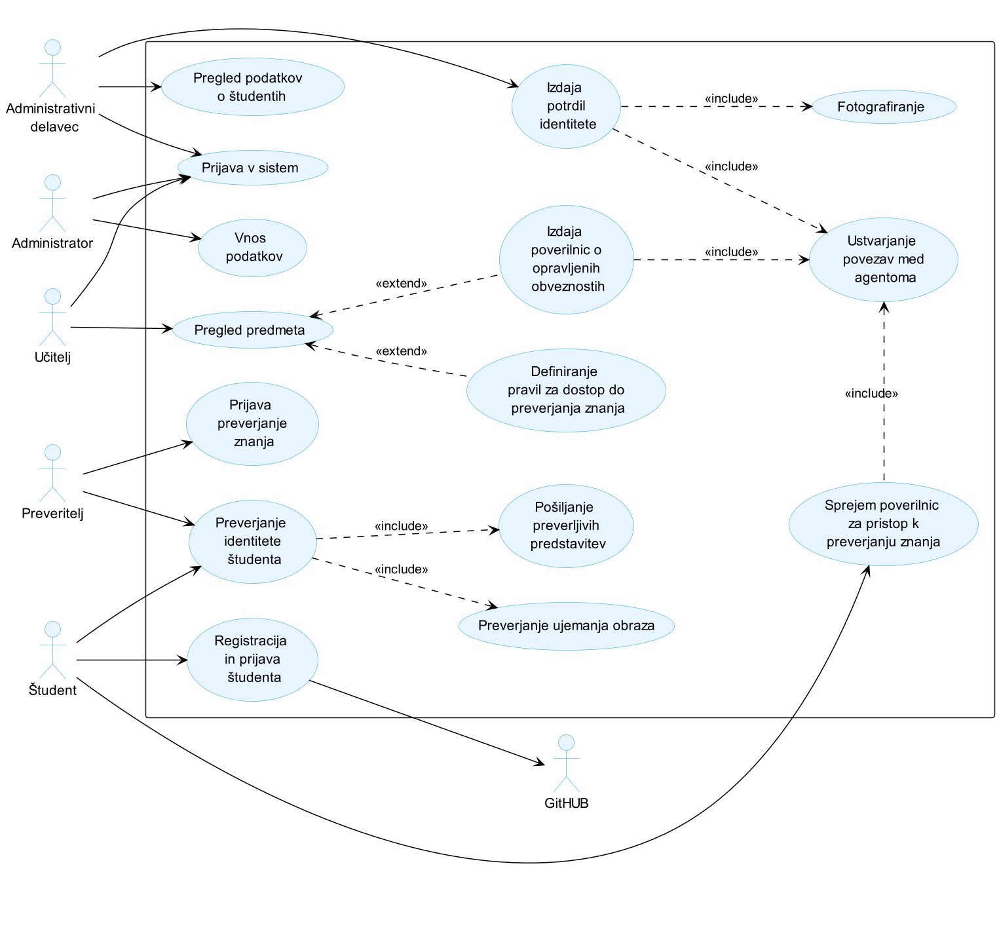

# MojIzpit

MojIzpit je rešitev, ki implementira koncept SSI za identifikacijo in avtorizacijo študentov pri preverjanjih znanja.

Predstavlja diplomsko nalogo na Fakulteti za računalništvo in informatiko Univerze v Ljubljani.

## Pregled repozitorija

| Mapa                 | Vsebina                                                         |
|----------------------|-----------------------------------------------------------------|
| **backend**          | Fakultetna aplikacija                                           |
| **wallet**           | Aplikacija študentskih denarnic                                 |
| **acapy-main**       | SSI agent (vir: https://github.com/openwallet-foundation/acapy) |
| **von-network-main** | Testno omrežje (vir: https://github.com/bcgov/von-network/blob/main/docs/UsingVONNetwork.md)                                          |

### Komponentni diagram rešitve



## Zagon rešitve


Aplikacija se lahko zažene v okolju Docker.

V mapi **backend** je potrebno dodati še datoteki **.env**, kjer opredelite naslednje spremenljivke:
```
JWT_SECRET
ADMIN_API_KEY
```

V mapi **wallet** je potrebno dodati še datoteki **.env**, kjer opredelite naslednje spremenljivke:
```
JWT_SECRET
ADMIN_API_KEY
FABER_ADMIN_API_KEY
```

V mapi **von-network-main** je potrebno dodati še datoteki **.env**, kjer opredelite naslednje spremenljivke:
```
JWT_SECRET
ADMIN_API_KEY
```

in dodate naslednjo vsebino:
```
IP=
IPS=
LOG_LEVEL=info
RUST_LOG=warning
GENESIS_URL=
LEDGER_SEED=000000000000000000000000Trustee1
LEDGER_CACHE_PATH=
MAX_FETCH=50000
RESYNC_TIME=120
POOL_CONNECTION_ATTEMPTS=5
POOL_CONNECTION_DELAY=10
REGISTER_NEW_DIDS=True
LEDGER_INSTANCE_NAME=localhost
WEB_ANALYTICS_SCRIPT=
INFO_SITE_TEXT=
INFO_SITE_URL=
INDY_SCAN_URL=
INDY_SCAN_TEXT=
```

### Zgradba slik

- Za zgradbo slike ACA-PY (https://github.com/openwallet-foundation/acapy) prosimo izvedite naslednje ukaze:
```
cd acapy-main
docker build --platform linux/amd64 -t aries-cloudagent-run -f ./docker/Dockerfile.run .
```

- Za zgradbo slike spletne strani zaposlenih na fakulteti prosimo izvedite naslednje ukaze:
```
cd backend
docker build --no-cache -t backend-node-api .
```

- Za zgradbo slike spletne aplikacije študentov prosimo izvedite naslednje ukaze:
```
cd wallet
docker build --no-cache -t wallet-backend-node-api .
```

- Za zgradbo slike omrežja VON (https://github.com/bcgov/von-network/blob/main/docs/UsingVONNetwork.md) prosimo izvedite naslednje ukaze:
```
cd von-network-main
docker build  -t von-network-base .
```

### Zagon vsebnikov

```
cd von-network-main
docker compose up --detach
```

Študentska spletna aplikacija je na voljo na **localhost:3000**, spletna aplikacija zaposenih na fakulteti pa na **localhost:4000**.

### Fakultetna aplikacija (localhost:3000)

### Diagram primerov uporabe




#### Vnos podatkov
Pred uporabo aplikacije je potreben vnos podatkov.
Za vnos podatkov se prijavite v sistem z naslednjimi podatki:

**elektronski naslov**: test.admin@mail.com

**geslo**: TestPassword1